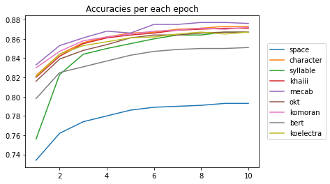

# 한국어 토크나이저 비교

[네이버 영화리뷰 데이터](https://github.com/e9t/nsmc)의 분류 모델이 한국어 토크나이저에 따라 어떻게 성능이 달라지는지 살펴본다.

## 모델
* 2-layer 2-directional LSTM with dropout and linear layers

## 토크나이저 
* 여백 단위(space)
* 음절 단위(character)
* [자모 단위(syllable)](https://smothly.github.io/data%20science/nlp/2019/11/23/%ED%95%9C%EA%B8%80%EC%9E%90%EB%AA%A8%EB%B6%84%EB%A6%AC.html)
* [khaiii](https://github.com/kakao/khaiii)
* [mecab](https://konlpy-ko.readthedocs.io/ko/v0.4.3/api/konlpy.tag/)
* [okt](https://konlpy-ko.readthedocs.io/ko/v0.4.3/api/konlpy.tag/)
* [komoran](https://konlpy-ko.readthedocs.io/ko/v0.4.3/api/konlpy.tag/)
* [bert](https://huggingface.co/bert-base-multilingual-uncased)
* [koelectra](https://huggingface.co/monologg/koelectra-base-v2-discriminator)

## 결과

* 에폭별 Loss 및 Accuracy




* 토크나이저별 최고 성능
<table>
  <thead>
    <tr style="text-align: left;">
      <th></th>
      <th>space</th>
      <th>character</th>
      <th>syllable</th>
      <th>khaiii</th>
      <th>mecab</th>
      <th>okt</th>
      <th>komoran</th>
      <th>bert</th>
      <th>koelectra</th>
    </tr>
  </thead>
  <tbody>
    <tr>
      <th>loss</th>
      <td>0.432</td>
      <td>0.307</td>
      <td>0.315</td>
      <td>0.319</td>
      <td>0.303</td>
      <td>0.320</td>
      <td>0.312</td>
      <td>0.351</td>
      <td>0.320</td>
    </tr>
    <tr>
      <th>acc</th>
      <td>0.793</td>
      <td>0.873</td>
      <td>0.867</td>
      <td>0.871</td>
      <td>0.877</td>
      <td>0.867</td>
      <td>0.872</td>
      <td>0.851</td>
      <td>0.867</td>
    </tr>
  </tbody>
</table>

* 토크나이저별 데이터 로딩 및 훈련 시간

<table>
  <thead>
    <tr style="text-align: left;">
      <th></th>
      <th>space</th>
      <th>character</th>
      <th>syllable</th>
      <th>khaiii</th>
      <th>mecab</th>
      <th>okt</th>
      <th>komoran</th>
      <th>bert</th>
      <th>koelectra</th>
    </tr>
  </thead>
  <tbody>
      <tr>
      <th>데이터 로딩 시간</th>
      <td>1.8</td>
      <td>2.2</td>
      <td>6.1</td>
      <td>125.4</td>
      <td>10.8</td>
      <td>275.3</td>
      <td>98.1</td>
      <td>19.9</td>
      <td>18.8</td>
    </tr>
    <tr>
      <th>평균 훈련 시간</th>
      <td>17.4</td>
      <td>52.1</td>
      <td>119.4</td>
      <td>33.6</td>
      <td>31.5</td>
      <td>26.2</td>
      <td>32.5</td>
      <td>37.6</td>
      <td>33.8</td>
    </tr>
  </tbody>
</table>

* Mecab 토크나이저가 전반적으로 가장 성능이 뛰어난 편이며, 의외로 문자 단위 토크나이저도 괜찮은 편이다. 다만 훈련 시간이 꽤 긴 편이어서 추가적인 원인 파악이 필요할 것으로 보인다.

## Requirements

```
Python==3.7.3
khaiii==0.4
konlpy==0.5.2
numpy==1.18.5
pandas==1.0.4
torch==1.5.0
torchtext==0.6.0
tqdm==4.46.1
transformers==3.0.2
```    

## Usage

네이버 영화 리뷰 데이터를 다운 받아 data 폴더 안에 저장한 후 다음 코드를 차례대로 실행한다.

```shell
python data_preprocess.py
python main.py [--n_epochs N_EPOCHS] [--max_vocab_size MAX_VOCAB_SIZE]
               [--batch_size BATCH_SIZE] [--embedding_dim EMBEDDING_DIM]
               [--hidden_dim HIDDEN_DIM] [--n_layers N_LAYERS]
               [--bidirectional BIDIRECTIONAL] [--dropout DROPOUT]
```

모든 토크나이저에 대해 훈련이 끝나고 나면 훈련 결과가 `result.json` 파일로 저장된다.
